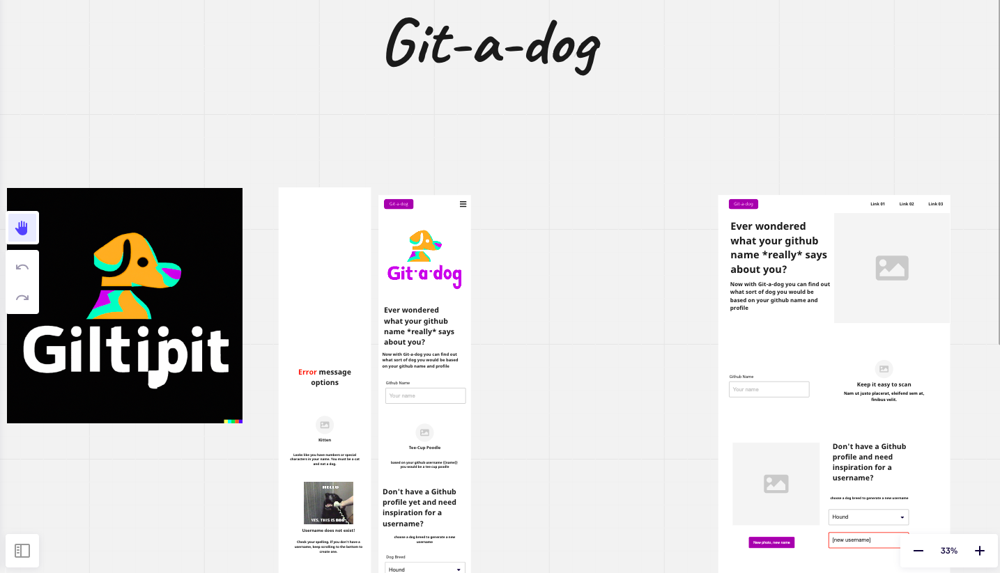
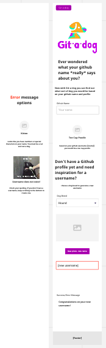
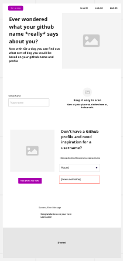
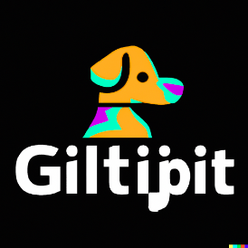

## Project

The project this week was to build an app that queries at least two APIs and uses the results to update the DOM. 
We decided to use [Github's API](https://docs.github.com/en/rest?apiVersion=2022-11-28) and the [dog.ceo API](https://dog.ceo/dog-api/) so that we could match github usernames to images of dogs.

#### About the repo
- The purpose of this repo is to produce our app in collaboration and build on github skills.

#### Why we created this repo
- This repo stores the stages of our app development
- It provides access to the website for visitors
- It enables us to review eachothers work and merge asynchronous work

#### User Story

As a user, I want to:

- Use my github data to find my perfect dog breed
- Create a github username according to a dog breed of my choice
- View the app on all of my devices

#### Acceptance Criteria 

[x] Query at least two APIs using fetch

[x] Dynamic content generated with JS

[x] A clearly defined user journey, documented in your readme

[x] A responsive, mobile-first design

[x] Ensure your app is accessible to as many different users as possible

#### Building the app

- We used [Miro](https://miro.com/app/board/uXjVPo2t_es=/) to create a wireframe

Mobile view

Web view

- We created our logo using Dall.e then edited this to reach a final image we were happy with

